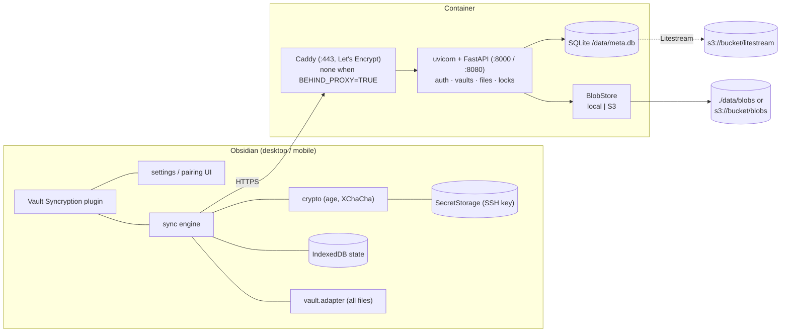
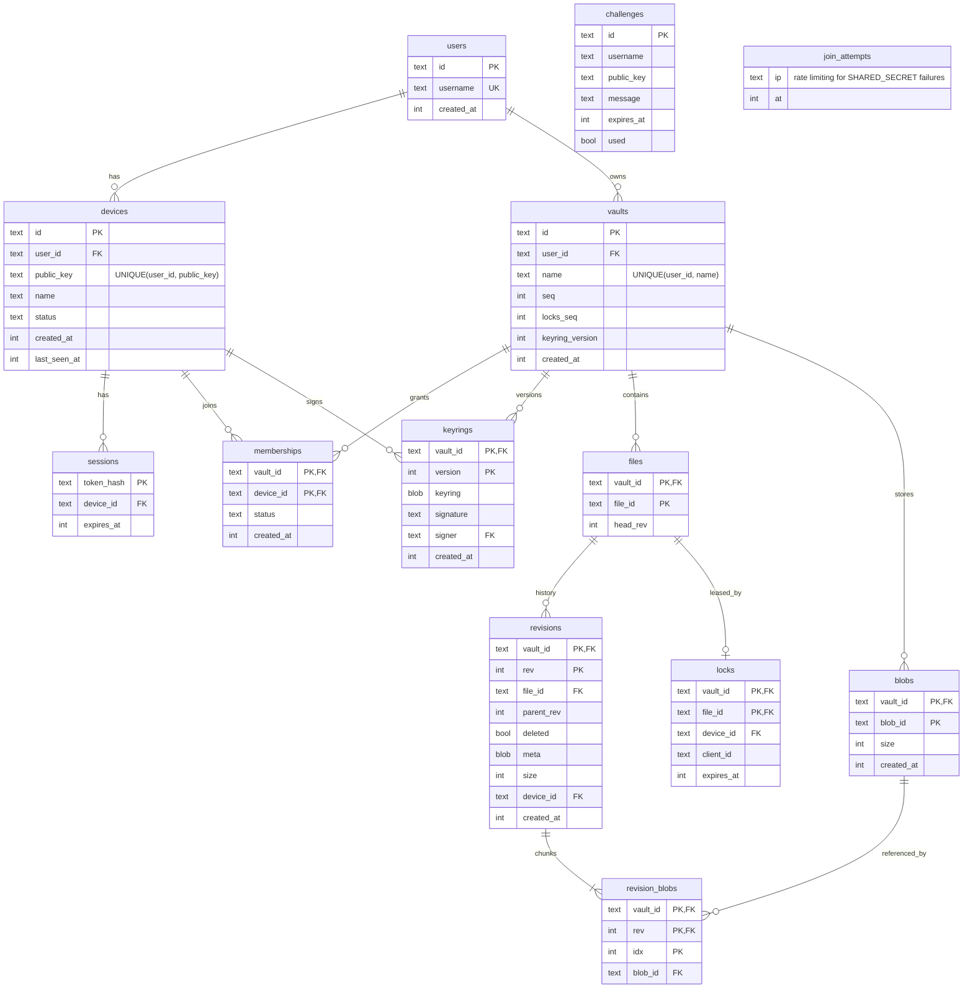
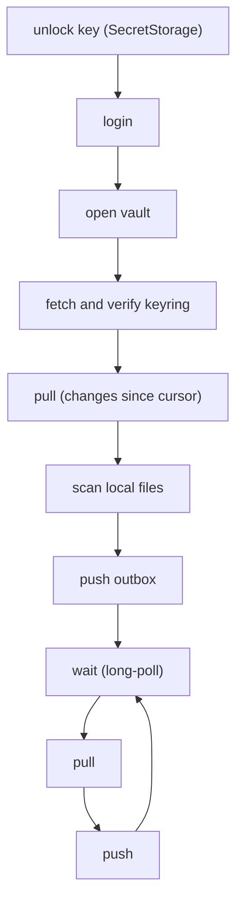

# Vault Syncryption Architecture

Status: first draft (M0). The design rationale is in [PLAN.md](PLAN.md), the wire format
in [protocol.md](protocol.md) and the crypto in [crypto.md](crypto.md).

## 1. Overview

Everything the plugin sends is already encrypted, except the routing metadata listed in
[crypto.md](crypto.md) section 1. The server stores, orders and relays. It never merges
and never decrypts.

## 2. Backend (`backend/`)
Python 3.12, managed with uv. Package `syncryption_server` under `backend/src/`.

| Module | Responsibility |
|---|---|
| `app` | `create_app` factory (lifespan opens the database and blob store), hourly blob GC task, `/health`, version header |
| `config` | parses and validates `BEHIND_PROXY`, `URL`, `S3_*` (including the optional `S3_ENDPOINT`), `MIGRATE_TO_S3`, `SHARED_SECRET` |
| `db` | SQLite connection (WAL mode), schema migrations (`PRAGMA user_version`), `BEGIN IMMEDIATE` transaction helper |
| `errors` | `ApiError` and the handlers that turn every error into the protocol's `{error, message, details}` shape |
| `encoding` | `b64u`, RFC 3339 times, id formats |
| `sshkeys` | Ed25519 public-key parsing, fingerprints, pairing codes, sshsig verification |
| `state` | per-app state: settings, database, blob store, clock, rate limiter, long-poll notifier, blob locks |
| `auth` | challenges, sshsig verification, joining with `SHARED_SECRET`, session tokens |
| `devices` | device list, approval, revocation |
| `vaults` | open/create by name, membership and approval, keyring versions |
| `storage` | `BlobStore` protocol, `LocalBlobStore`, `S3BlobStore` |
| `blobs` | blob upload, download and `missing`, and the garbage collector |
| `sync` | revision commits with the `parentRev` check, history, change feed, long-poll |
| `locks` | lease locks and `locksSeq` (M6) |
| `migrate` | `MIGRATE_TO_S3` one-shot copy, run by the entrypoint before serving (M3) |

### 2.1 Data model (SQLite)

- Identity (`users`, `devices`, `sessions`) and data (`vaults`, `memberships` and below)
  are separate. The only links are `vaults.user_id` and `memberships.device_id`.
- The `revisions` table is the change feed: `rev` is the vault `seq`, so
  `WHERE vault_id = ? AND rev > ? ORDER BY rev` is the feed query.
- A commit is one `BEGIN IMMEDIATE` transaction: check the head, check the blobs, bump
  `vaults.seq`, insert the revision, move `files.head_rev`. SQLite serialises writers,
  which gives a total order per vault without extra locking.
- Ids are text: UUIDv4 for users and vaults, `d_...` for devices. Times are integer Unix
  seconds.
- There is one `sqlite3` connection and every handler is `async`, so the database is only
  touched from the event loop thread. Nothing is awaited inside a transaction.

### 2.2 Blob store
```python
class BlobStore(Protocol):
    async def put(self, key: str, data: bytes) -> None: ...
    async def get(self, key: str) -> bytes: ...
    async def exists(self, key: str) -> bool: ...
    async def size(self, key: str) -> int | None: ...
    async def delete(self, key: str) -> None: ...
    def iter_keys(self, prefix: str = "") -> AsyncIterator[str]: ...
```
- Key: `blobs/<userId>/<vaultId>/<blobId[0:2]>/<blobId>`, identical in both stores.
- `LocalBlobStore` writes to a temporary file in the same directory, `fsync`s it and
  renames it into place, so a crash never leaves a partial blob under its final name.
- `S3BlobStore` uses `aioboto3`. The region comes from `GetBucketLocation` at startup. With
  `S3_ENDPOINT` set and a provider that doesn't implement it, the region is `us-east-1`.
- Blob rows are written after the store write succeeds, so a blob row always means the
  bytes are there.
- The garbage collector deletes blobs that no revision references and that are older than
  24 h: first the row, then the stored object. Uploads and the collector take the same
  per-blob lock, so an upload that arrives during collection is never half deleted.

### 2.3 Long-poll
Each vault has an `asyncio.Condition`. A commit or lock change notifies it after the
transaction commits. `/wait` re-checks `seq`/`locksSeq` under the condition before
waiting, so no wake-up is lost. There is one container and one uvicorn worker, so this
in-process mechanism is enough. Running several workers would need a different
notification path and is out of scope.

## 3. Container (`backend/Dockerfile`, `backend/entrypoint.sh`)
The image is built in three stages: a `ghcr.io/astral-sh/uv` stage that installs the
locked dependencies into `/app/.venv`, the Litestream 0.5.17 release binary (checked
against a pinned SHA-256) and the Caddy 2.11 binary from the official image. The runtime
is `python:3.12-slim-bookworm`. The entrypoint uses small commands from
`python -m syncryption_server` (`check`, `render`, `migrate`, `health`), so the
environment rules live in one place (`config.py`).

1. `check` validates the environment (rules in [PLAN.md](PLAN.md), Hosting), prints a
   one-line summary without secrets, and exits with a clear message on any error.
2. `render` writes the generated config into `/run/syncryption`: a `Caddyfile` when
   `BEHIND_PROXY=FALSE` (`admin off`, certificates in `/data/caddy`, `reverse_proxy` to
   uvicorn) and a `litestream.yml` when S3 is enabled. Credentials are not written to
   disk: the file refers to `${S3_ACCESS_KEY}` and `${S3_SECRET_KEY}`, which Litestream
   expands when it loads it.
3. If S3 is enabled: `litestream restore -if-db-not-exists -if-replica-exists`, so a new
   host can be rebuilt from the bucket.
4. If `MIGRATE_TO_S3=TRUE`: run the migration and stop on failure. The server is not
   listening yet, so clients see connection errors and back off.
5. Start the app:
   - `BEHIND_PROXY=FALSE`: uvicorn on `127.0.0.1:8000` with `--proxy-headers
     --forwarded-allow-ips 127.0.0.1` (so client IPs come from Caddy), and Caddy in front
     on 80/443.
   - `BEHIND_PROXY=TRUE`: uvicorn on `0.0.0.0:8080` with `--no-proxy-headers`. The app
     reads `X-Forwarded-*` itself.
   - With S3, everything runs under `litestream replicate -exec`, so the database is
     replicated while the app runs and Litestream stops when the app does.
6. The entrypoint supervises the processes with `wait -n`: if uvicorn or Caddy exits, the
   other is stopped and the container exits with an error. `docker stop` (SIGTERM) shuts
   everything down cleanly and exits 0.

The healthcheck runs `python -m syncryption_server health`, a GET of `/health` on the
local uvicorn port.

`backend/container-checks.sh` builds the image, checks that bad environments are refused,
starts a container behind a proxy, runs `tests/test_container.py` inside it, and checks a
clean stop. CI runs it in the `container` job.

## 4. Plugin (`plugin/`)
| Module | Responsibility |
|---|---|
| `main` | plugin lifecycle, commands, status bar, event wiring |
| `settings`, `keys`, `ui` | settings tab: endpoint, username, vault name, key import/generate (the key goes to `SecretStorage`), exclude list. Join, passphrase, pairing, approval and reload dialogs, file history and restore |
| `obsidian` | `requestUrl` transport, and the `VaultFs` over the Vault API |
| `crypto` | OpenSSH key parser/writer, age `ssh-ed25519` recipient/identity, sshsig, keyring, file and metadata objects |
| `api` | typed client over a `Transport` (`requestUrl` in the plugin, `fetch` in tests). `src/api/schema.ts` is generated from the server's OpenAPI with `npm run api-types` (CI checks it is current) |
| `sync` | vault session (login, join, create or open the vault, pairing, keyring pinning), sync engine, scanner, merge, conflict copies, path filter, the `VaultFs` over `vault.adapter` for the config folders, lock manager, long-poll loop |
| `store` | IndexedDB: cursor, path table, outbox, pinned keyring |

### 4.1 Local state (IndexedDB)
One database per Obsidian vault and remote vault: `syncryption-<installId>-<vaultId>`. The
install id is a random UUID in `app.saveLocalStorage`, which Obsidian keeps per vault, so
two local vaults never share state. If the stored vault id doesn't match, the database is
cleared.

| Store | Contents |
|---|---|
| `meta` | `cursor`, `vaultId`, pinned keyring `keyringPin` `{version, sha256}`, `deferred` (remote revisions held back until the end of a pull, see 4.2), `failed` (remote revisions that couldn't be written here, tried again on every pull) |
| `files` | `path → {fileId, rev, deleted, sha256, size, mtime}`: the last synced state of each file |
| `outbox` | `path → {path, id, queuedAt}`, one entry per path. Whether it is an upload or a deletion is decided when it is pushed, from the file on disk. A push removes the entry only if its `id` is unchanged, so a change made during the push is not lost |

There is no store of merge bases: the base is the synced revision, fetched from the server
with `GET /files/{fileId}/revs/{rev}` when a merge needs it. A merge therefore needs the
server, which a merge always does anyway (it starts from a remote change).

### 4.2 Sync loop

- **Pull:** for each change, decrypt the metadata, check it (crypto.md 8.3), and compare
  with `files`. The local file is always hashed first, so a stat that looks unchanged
  can't let a remote write replace an edit. If the local file is unchanged since the last
  sync, write the remote version. If both sides changed, merge. Equal content is adopted
  without a write. A revision that fails its checks is skipped with a warning. If writing
  a revision fails (a name this file system refuses, or one that differs only in case from
  another file on a case-insensitive file system), it is kept in `meta.failed`, a warning
  is shown once, and the pull goes on; every later pull tries it again.
- **Deletions:** a remote deletion of a file edited here keeps the edit and commits it on
  top of the deletion. A local deletion of a file edited elsewhere loses to the edit.
- **Push:** for each outbox entry, read the file, encrypt the chunks, upload the missing
  blobs, then commit with `parentRev` from `files`. On `409`, apply or merge the head
  returned in the error, which queues the result for the next push round (at most 5 per
  sync). A `400`, `413` or `422` for one file keeps it queued and the sync goes on.
- **Live updates:** `LiveLoop` long-polls `/wait` (protocol.md 10.2). A new `seq` runs a
  sync; a new `locksSeq` refetches the lock list. Local changes sync 2 seconds after the
  last one, and a 2-minute timer is the fallback when a wait is lost. When the app comes
  back to the foreground or the network returns, the loop's backoff ends and a sync runs;
  if connecting failed for want of a network, the plugin connects again then and on the
  timer. Every request gives up after 60 seconds (`NetworkError`), so one that hangs while
  a mobile app is suspended doesn't stall later syncs.
- **Locks:** `LockManager` holds a soft lock on the mergeable note in the active editor
  and renews it every `ttl / 2`. The `clientId` is 16 random bytes in the app's local
  storage. If another device holds the note, a notice says so once, and a status-bar item
  shows "<device> is editing" while that note is active. Locks never block an edit or a
  commit: a concurrent edit still goes through the 409 merge.
- **Merge:** text files (by extension: md, txt, canvas, base, json, css, js, csv, tsv,
  yaml, yml, html, xml, svg) go through diff3 (`node-diff3`) with the base revision. A
  clean result is committed; JSON and canvas results must still parse. Otherwise the
  remote version wins the path and the local version is saved as
  `name (conflict <device> YYYY-MM-DD HHmm).ext`, with ` 2`, ` 3`... for more copies in
  the same minute. Binary files always get a conflict copy.
- **Files on disk:** notes and attachments go through the Vault API (`ObsidianFs`), so
  Obsidian's index stays current. Obsidian doesn't index hidden folders, so every
  `.obsidian*` folder at the vault root (the active `configDir` and the profiles of other
  devices) is listed, read and written through `vault.adapter` (`AdapterFs`). If an
  adapter can't list the vault root, only the active `configDir` is synced. Other hidden
  files and folders aren't synced.
- **Config files:** a pull holds back the active `configDir/community-plugins.json` and
  writes it after everything else, so plugins are on disk before Obsidian turns them on.
  The held-back revisions are saved in `meta.deferred` before the cursor moves past them.
  After a sync that wrote to the active `configDir`, the plugin asks once per session to
  reload Obsidian (`app:reload`). On a device's first sync of a config file (no synced
  state, both sides have it), the vault's version replaces the local one without a
  conflict copy, so a new device takes the vault's settings instead of pushing its
  defaults as conflicts. After that, config files merge like notes (JSON must still parse).
- **History and restore:** "Show file history" (also "Sync history" in the file menu)
  lists a file's revisions newest first, 50 at a time, from `GET .../revs`. Each row comes
  from the decrypted metadata (size, deletion, the writing device, named from the
  keyring); revisions that fail their checks are left out and counted. Text files can be
  previewed. Restoring syncs first, so unsynced local edits become a revision of their
  own, then writes the old content to the file and commits it as a new revision on top of
  the head; history is never rewritten. "Restore a deleted file" lists the synced paths
  whose last revision is a deletion and opens the same history.

- **Pairing:** a device whose vault membership is pending shows its pairing code and
  polls every 5 seconds. On an active device, "Approve devices" lists pending members
  with codes computed locally from their public keys. Approving adds the device to the
  keyring, uploads the next version (retrying on `409 keyring_version`), then approves the
  membership.
- **Recovery key:** offered once after this device creates a vault, and in the settings
  (create, replace, remove). A new key is shown once and set only after the user confirms
  they stored it. The pairing dialog has "Use a recovery key": the device opens the
  current keyring with it, adds itself, and uploads the next version signed by the
  recovery key; the server activates the membership and connect goes on at the next poll
  (crypto.md 9).
- **Removing a device:** the settings list the other devices of the keyring. "Remove" ends
  the membership on the server (or revokes the device for the whole account), then uploads
  the next keyring without it under a new epoch. If the removed device set the recovery
  key, that goes too and the user is asked to create a new one. On connect, keyring
  devices that are no longer members are removed the same way (crypto.md 8.4).
- **Re-encryption:** each sync ends by committing again, under the current epoch, the
  unchanged live files whose last synced revision used an older one (`SyncedFile.epoch`).
  The engine fetches the keyring when the change feed reports a newer version, or once
  when a revision uses an unknown epoch.
- **Keyring pinning:** on connect, the pinned version is fetched again and compared with
  the pin, then every later version is checked in order (crypto.md 6.4).

### 4.3 Change detection
- The Vault API's `create`, `modify`, `delete` and `rename` events cover notes and
  attachments. The undocumented `vault.on('raw')` event covers the hidden config folders;
  only its hidden paths are used.
- A scan on every sync (and so on startup) compares `mtime`/`size` with `paths`
  and hashes candidates, as a fallback.
- Excluded paths ([PLAN.md](PLAN.md), Sync Scope) are filtered before anything is queued.
  A scan doesn't descend into excluded folders such as `node_modules`.
- **Exclude list:** one pattern per line in the settings, kept per device in the plugin's
  `data.json` (which is itself never synced). A pattern is vault-relative and matches the
  path or anything inside it; `*` and `?` match within a path segment and `**` across
  segments. Lines starting with `#` are comments. Excluding a synced path stops syncing it
  without deleting it anywhere.

## 5. Repository and CI
- `testvectors/` is read by both the pytest and the vitest suites.
- CI (Gitea Actions) runs `ruff check`, `ruff format --check`, `pytest`, `eslint`,
  `vitest` and the plugin build on every PR. Interop tests against the Go `age` CLI run in
  CI from M1.
